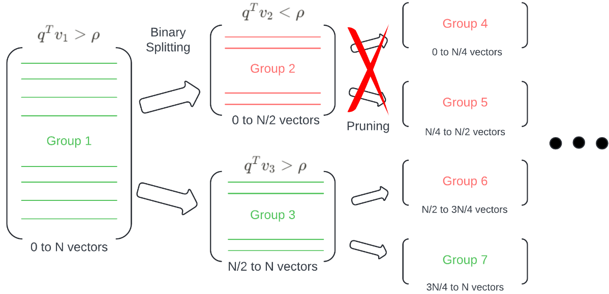
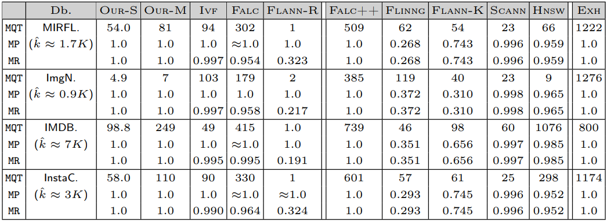
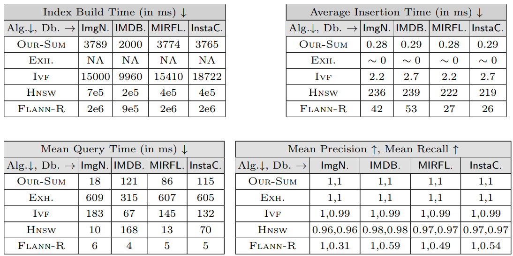

# Group Testing for Accurate and Efficient Range-Based Near Neighbor Search for Plagiarism Detection
### Authors : Harsh Shah, Kashish Mittal, Ajit Rajwade  
(from Computer Science Department at Indian Institute of Technology Bombay)

This code repository has official implementation of paper **Group Testing for Accurate and Efficient Range-Based Near Neighbor Search for Plagiarism Detection** accepted in *European Conference on Computer Vision ECCV 2024*. 

## Abstract 
This work presents an adaptive group testing framework for the range-based high dimensional near neighbor search problem. Our method efficiently marks each item in a database as neighbor or non-neighbor of a query point, based on a cosine distance threshold without exhaustive search. Like other methods for large scale retrieval, our approach exploits the assumption that most of the items in the database are unrelated to the query. Unlike other methods, it does not assume a large difference between the cosine similarity of the query vector with the least related neighbor and that with the least unrelated non-neighbor. Following a multi-stage adaptive group testing algorithm based on binary splitting, we divide the set of items to be searched into half at each step, and perform dot product tests on smaller and smaller subsets, many of which we are able to prune away. We experimentally show that, using softmax-based features, our method achieves a more than ten-fold speed-up over exhaustive search with no loss of accuracy, on a variety of large datasets. 

## Method


- **Overview**: A pool of high-dimensional vectors is created by summing together participating vectors (e.g., images or their features). The goal is to efficiently identify 'defective' vectors in a database.

- **Database and Query**:
  - Database D = {f1, f2, ..., fN}, where each fi is in R^d
  - Query vector q in R^d
  - Similarity measure: sim(q, fi) = q^T fi (cosine similarity)

- **Goal**: Retrieve all vectors fi for which q^T fi >= ρ, where ρ is a pre-specified threshold.

- **Binary Splitting**:
  - Sum vectors to form pools (e.g., y = f1 + f2 + f3 + f4)
  - If q^T y < ρ, all vectors in the pool are non-defective.
  - If q^T y >= ρ, split the pool into smaller pools and test recursively.

- **Recursive Process**:
  - Start with pool y0 (sum of all N vectors).
  - If y0 is positive, split into y11 and y12, and test.
  - Continue splitting positive pools until pools contain single vectors.

- **Efficiency**:
  - Maintain cumulative sums: f~i = f1 + f2 + ... + fi.
  - Create pools efficiently using these cumulative sums.

- **Iterative Implementation**:
  - Use a stack to manage pool testing.
  - Mark vectors as neighbors or non-neighbors based on similarity threshold ρ.

This method saves on the number of tests while maintaining accuracy, particularly useful for high-dimensional NN search.

## Results
### Static Database Results


### Streaming Results (incremental dataset)


## Analysis of method
Kindly refer to section 5 (Theoretical Analysis) of the paper for detailed analysis on the upper bound on expected number of dot products for each of the methods.


## Repository Details
### Installing dependencies
[anaconda is required]  
Firstly clone this repository, and having this as working directory, run 
```
chmod +x install_dependencies.sh
./install_dependencies.sh
```
### Downloading datasets 
The datasets `MIRFLIKR`, `IMDB-WIKI` and `InstaCitites` can be downloaded using the script `download_datasets.sh`. The script will also extract VGG16 features from the images of the datasets. If you want to have a different directory for the datasets, change the root variable in the bash script, `download_datasets.sh`
```
chmod +x download_datasets.sh
./download_datasets.sh
```
This would create the following directory structure for each dataset.
```
|-datasets
  |-mirflickr 
    |-images
      |...
    |-output
      |-X.txt
      |-Q.txt
```
`X.txt` contains the database vectors in csv format with `N` rows and `dim=1000` columns. Similarly, `Q.txt` contains the database vectors in csv format with `Nq` rows and `dim=1000` columns.  

Create a similar directory structure for ImageNet, which can be downloaded from [Kaggle](https://www.kaggle.com/competitions/imagenet-object-localization-challenge/data )
It is fine if `images` directory has sub-directories containing images. But do not keep any other files in the directory (like meta-data, labels, etc.)

### How to run?
The implementation of our method can be found in `c_src/GTnn`. Below is description of each file:
1. `c_src/GTnn/GT_NN_SUM.hpp` : Implementation of the _sum_ method. Example usage can be found in `c_src/GTnn/example_GTsum.cpp`
2. `c_src/GTnn/GT_NN_MAX.hpp` : Implementation of the _signed-max_ method. Example usage can be found in `c_src/GTnn/example_GTmax.cpp`
3. `c_src/GTnn/GT_NN_SUM_STREAMING.hpp` : Modification of the _sum_ method to evaluate the performance in streaming settings. Example usage can be found in `c_src/GTnn/example_GTstreaming.cpp`  

Refer `run.sh` for running experiments on ImageNet. Change the `dataset_root_path` in `run.sh` for other datasets.  

Streaming experiments requires a runbook. We have provided a script (`py_src/utls/generate_runbook.py`) to create runbooks. Change the variables inside the file for different datasets.  
* `N` -> Number of points in the database of vectors  
* `MAX_SUM` -> Number of new points to insert in total = `(1-init_frac)*N`. init_frac can be set in build_index function. See `c_src/GTnn/example_GTstreaming.cpp` 
* `INSERTION_RANGE` -> Maximum number of points to be inserted in a single insertion query for the steraming experiments.
### Other experiments
**Testing other algorithms**
`algorithms.py` has NN search algorithms, and `datasets.py` has the vector datasets. To run the experiments (static datasets),
```
python main.py --data-dir ./datasets --results-dir ./results --datasets MIRFLICKR InstaCities --algorithms FAISS_GT SCANN --seed 73 --try-params 
``` 
For streaming experiments, example usage
```
python main.py --data-dir ./datasets --results-dir ./results --datasets MIRFLICKR InstaCities --algorithms FAISS_GT SCANN --seed 73 --try-params --streaming --runbook streaming_runbook.json
``` 
[Need to create a runbook before running the streaming experiments] 
**Plotting similarity distribution**  
Similarity distribution can be plotted using `py_src/utils/similarity_distribution.py`. Example usage:
```
python similarity_distribution.py --dataset-name imagenet --fetchpath datasets/imagenet/output --savepath plots/
```
**Image Retrieval Experiments**
To conduct class based image retrieval experiments for analysing performance for softmax and non-softmax features, use `py_src/utils/retrieval_exp.py`. Example usage:
```
python retrieval_exp.py --dataset-name Corel10 --fetchpath datasets/corel10/images --savepath datasets/corel10/output --respath results
```
Use `--no-softmax` ig you want to analyse performance without having softmax. By deafult VGG16 features are used, but `--resnet` argument for using resnet50 features.

## Limitations
- The described method works well only with datasets having sharp decline in the similarity distribution
- Python bindings for the described method to be developed in future versions
- Better tests can be formulated to incorporate negative descriptors (like coefficient in PCA bases), currently we have analyzed only signed-maximum method.
